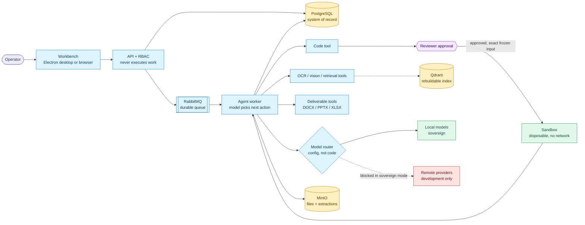

<table>
  <tr>
    <td width="220">
      
    </td>
    <td>
      <h1>SIH-26117 — Kavach</h1>
      <h3>Sovereign Industrial AI Workbench</h3>
    </td>
  </tr>
</table>

---

An on-premise AI workbench for confidential industrial knowledge work. Upload a document or state a task; an agent reads it, looks at it, searches indexed internal material, runs code when a human approves, and hands back a real deliverable — a DOCX approval note, a PPTX deck, an XLSX workbook with live formulas, source code — with every claim traceable to evidence and every step recorded.

Every piece of state lives in services the organization controls: PostgreSQL, MinIO, Qdrant, RabbitMQ. The model layer is a config file, so the same code path runs against a remote provider in development and a local open-weight model in a deployment with no route to the internet.

The model is not the interesting part. The work here is what surrounds it: durable execution that survives a crash mid-run, a human approval gate on consequential actions, evidence kept separate from model opinion, and sovereignty enforced in layers rather than by a flag.

📖 **[Full documentation → docs/ARCHITECTURE.md](./docs/ARCHITECTURE.md)** — architecture, diagrams, every subsystem, operations runbook, and an honest built-vs-not-built list.
🎤 **[Presentation script → docs/PRESENTATION.md](./docs/PRESENTATION.md)** — timed two-speaker script, demo runbook, likely questions.

---

## How it fits together



The API writes the run and an outbox event in one transaction and returns; a worker picks it up. So a run survives an API restart between "accepted" and "started". The agent then chooses its own next step — it can read a document, find the OCR garbled, look at the page as an image, search internal manuals for what's missing, and revise — until it finishes through an explicit `final.answer` tool call. Turns, tool calls, tokens, and wall-clock are all budgeted per run.

[Full architecture, sequence diagram, and target state →](./docs/ARCHITECTURE.md#system-at-a-glance)

---

## Quick start

```bash
cp .env.example .env      # then change every development secret
docker compose up -d --build
```

- API: `http://localhost:4000` — check with `curl localhost:4000/health`
- Browser workbench: `http://localhost:3000` — sign in with the seeded admin credentials from `.env`

Desktop client:

```bash
cd ide && npm install && npm run dev
```

Sovereign deployment — publishes nothing, keeps `backend` and `worker` on a closed network with no gateway, disables every remote profile, and strips remote credentials:

```bash
docker compose -f docker-compose.yml -f docker-compose.sovereign.yml up -d --build
```

This needs a local model endpoint already reachable; the registry defaults assume something Ollama-shaped at `host.docker.internal:11434`. Nothing is auto-pulled — you bring your own runtime. See [pointing it at your own Ollama](./docs/ARCHITECTURE.md#pointing-it-at-your-own-ollama), including the tool-calling requirement that rules out some small models.

Hot reload for development:

```bash
docker compose -f docker-compose.yml -f docker-compose.dev.yml up -d --build backend worker frontend
```

⚠️ The dev override builds `backend` and `worker` under the same image tags as the base file, from `Dockerfile.dev`. After using it, return to the normal stack with `docker compose up -d --build` — without `--build` the production containers start from dev images and fail on a missing `dist/`.

---

## Layout

| Path | What's in it |
|---|---|
| `backend/` | Express API and the agent worker. `src/modules/` by domain, `src/infrastructure/` for replaceable boundaries — models, embeddings, extraction, storage, queue, sandbox, vector store |
| `backend/config/models.json` | The entire model registry: providers, profiles, capabilities, priorities, pricing. No vendor name appears in application code |
| `frontend/` | Next.js browser workbench — login, workbench, artifacts, knowledge, audit, admin. Proxies to the API via `BACKEND_INTERNAL_URL`, so the browser needs no access to the API network |
| `ide/` | Electron desktop client. Chat-first, not a code editor; carries the run trace, approvals, document previews, and the governance views |
| `ops/` | Verifiers and operational scripts — sovereign-compose check, acceptance harness, agent-loop and tool-support probes, Qdrant snapshot/restore, secret rotation |
| `docs/` | [ARCHITECTURE.md](./docs/ARCHITECTURE.md) and [PRESENTATION.md](./docs/PRESENTATION.md) |

---

## Services

`backend` (API) · `worker` (agent and knowledge jobs) · `frontend` · `postgres` (system of record) · `minio` (files, extractions, deliverables) · `qdrant` (vector index, rebuildable) · `rabbitmq` (durable transport) · `docling` (OCR, layout, tables — optional) · `pdf-renderer` (bounded page rasterizer for vision) · `sandbox-runner` (disposable containers for generated code).

Only `backend` and `frontend` publish a host port. Everything else is reachable only on a network declared `internal: true`, which Docker gives no gateway — those containers have no route off the host.

---

## Sovereignty in one table

A remote model call requires **all five** of these. Any one failing blocks it before content is sent.

| Layer | Enforcement |
|---|---|
| Flag | `ALLOW_REMOTE_INFERENCE=true` |
| Provider | The selected profile's provider is marked `remote` |
| Credential | The variable named by `apiKeyEnv` holds a value |
| Classification | Data is `PUBLIC` or `SYNTHETIC` — `INTERNAL`/`CONFIDENTIAL` is refused in **every** mode |
| Network | The backend has an egress-capable network attached |

The process additionally refuses to boot if `APP_MODE=sovereign` is combined with `ALLOW_REMOTE_INFERENCE=true`, so a config mistake fails closed instead of quietly enabling egress.

`GET /api/sovereignty/posture` reports which controls are structurally always-on versus only active in the current mode, `GET /api/sovereignty/egress` is the ledger of recorded provider invocations, and `POST /api/sovereignty/egress-probe` actively tries to reach each provider host and reports blocked or reachable — a demonstration rather than a claim.

Sovereign mode removes the application's own path out. It is not a substitute for the organization's firewall.

---

## Verifying it

```bash
node ops/verify-sovereign-compose.mjs      # fails if the sovereign render leaks a route, credential, or port
cd backend
npm run typecheck && npm run test
npm run test:security                      # RBAC, artifact validation, approvals, provider policy
npm run test:openapi                       # contract matches registered routes
```

Black-box acceptance against a disposable stack, migration checks, live-provider probes, and the rest are in [Verification](./docs/ARCHITECTURE.md#verification).

---

## Status

Working: per-workspace RBAC with reviewer sign-off · durable cancellable runs with lease recovery · a model-driven agent loop with nine schema-validated tools and per-run budgets · approval-gated sandbox execution with the reviewed input frozen by a database trigger · OCR and layout extraction with page-level provenance · vision on scanned pages · access-filtered retrieval with resolvable citations · DOCX/PPTX/XLSX generation from persisted evidence · vendor-neutral model registry with fallbacks, telemetry, and cost estimation · sovereignty posture, egress ledger, and egress probe · OpenAPI 3.1 contract, admin-only readiness and metrics, audit search and export · backup, restore, and offline-bundle procedures.

Not done: bundled offline embedding model files (the local embedding profile assumes an external runtime) · reranking · zero-downtime embedding migration · complete sandbox audit persistence and runner attestation · OIDC/SSO · SBOM release artifacts.

The full list, with detail on each item, is in [Status — built vs not built](./docs/ARCHITECTURE.md#status--built-vs-not-built).

---

## Secrets

`.env` is git-ignored and stays that way. Never commit a key or paste one into an issue, a log, or a slide. Compose supplies `local-development-qdrant-key-change-me` only when an older local `.env` has no `QDRANT_API_KEY` — replace it with a long random value before any shared deployment. `node ops/rotate-local-secrets.mjs` regenerates local secrets.
