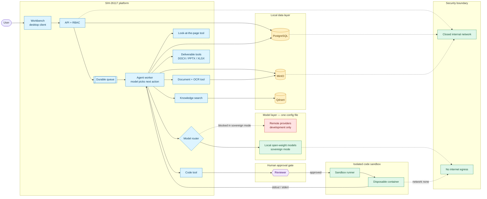

# SIH-26117 — Presentation script

Everything needed to present: the one-line pitch, a slide-ready diagram, a timed two-speaker script, a demo runbook, the risks slide, and answers to the questions that actually get asked. Technical claims here are kept in sync with [ARCHITECTURE.md](./ARCHITECTURE.md) — if the two ever disagree, that file is the source of truth.

**The pitch, in one sentence:**

> SIH-26117 is an on-premise AI workbench: upload a document or state a task, it runs through a durable, auditable agent loop, and comes back as a real deliverable with citations and a reviewer approval gate on anything risky — with a clear path to zero internet egress.

---

## Slide diagram

Screenshot this rather than relying on live Mermaid rendering; not every presentation tool renders it.

---

## Timing — 10 minutes, two speakers

Presenter 1 sets up the problem and what it delivers. Shaun runs the demo **and** the technical half — which is the reason this fits in ten minutes: the architecture is narrated *over* the running job rather than as a separate section.

| Elapsed | Who | What |
|---|---|---|
| 1:00 | P1 | Problem |
| 2:15 | P1 | Solution |
| 3:00 | P1 | What it delivers → handover |
| 7:30 | Shaun | Live demo — the document case, then code execution |
| 8:30 | Shaun | Dashboard glance — governance, and where requests actually went |
| 9:30 | Shaun | Status and roadmap |
| 10:00 | Shaun | Close |

**The demo is the presentation.** Four and a half minutes on agentic work, one minute glancing at the dashboards. The full sovereignty walkthrough — the five controls, the live egress probe — is *held in reserve* at the end of this document and produced only if someone asks. It is a strong answer to a question, and a poor use of a minute nobody asked for.

---

## Presenter 1 — 3:00 total

### Problem — 1:00

Refineries, PSUs, defence manufacturing, and government offices generate an enormous amount of sensitive routine work — approval notes, inspection reports, engineering drawings, internal code, correspondence. None of it can go anywhere near a public AI tool, because the data itself is confidential. So today teams either do all of it by hand, which is slow, or people quietly paste it into ChatGPT or Claude anyway, which is a real and growing risk nobody wants to admit out loud. Meanwhile open-weight models have become good enough that you can build a genuinely useful assistant without sending anything to the cloud. That gap — useful AI tooling that never leaves the building — is what we are solving.

### Solution — 2:15

SIH-26117 is that workbench, and it runs entirely on infrastructure the organization controls. You upload a document or hand it a task, it figures out which model suits the job, does the work, and hands back something real — a DOCX approval note, a PPTX deck, an XLSX workbook with live formulas, working code — not just a paragraph of chat text.

But the point of this project is not the model or the chat window, because frankly any team can wire a chatbot to an open-weight model in an afternoon. What is hard, and where our time went, is everything around it: an agent that decides its own next step and can back up and try a different approach, execution that survives a crash and resumes where it left off, a human reviewer who must approve anything risky before it happens, and an audit trail that can answer exactly what happened, when, and why, for every single task.

### What it delivers, and handover — 3:00

From the user's side this feels simple. You open a workspace, upload a report, ask for an approval note, and download the result a minute later. But behind that one interaction every run carries a full record — who asked, which model was picked and why, exactly which tools ran in which order, what evidence those tools pulled up, which claims are backed by a source versus produced by the model, and what came out the other end. If someone questions a generated approval note six months from now, you need to show exactly what it was based on.

> "Shaun is going to run it live and, while it works, walk through how it is actually built — why it is auditable, and how it runs with no route to the internet."

---

## Shaun — 7:00 total

### Demo — 3:00 → 7:30

Two agentic cases, back to back: a document task that produces a real deliverable, and a coding task that has to be approved before it runs. Between them they cover what the problem statement asks for — model selection across different task types, an agentic task carried end to end, multimodal understanding, and sandboxed code execution.

**The structural trick: start the run first, then talk.** Kick the job off inside the first forty-five seconds and deliver the architecture while it streams. Do not narrate the architecture to a static screen and then start a run — that is how this becomes a fifteen-minute talk again.

#### Case 1 — the document task (3:00 → 5:45)

**0:00–0:45 — set it going**

1. Sign in. Show the workspace.
2. Upload the prepared inspection report.
3. Type: *"Read this inspection report and draft an approval note with the key findings."* Send it.

**0:45–2:15 — talk while the trace panel fills**

Point at the trace panel as tool calls land, and say this over the top of it:

> "The API did not do any of this. It wrote the run to PostgreSQL, dropped it in a durable queue, and a separate worker picked it up. That matters because this run now survives a crash — it is not an HTTP request that dies when the connection drops. It can be resumed, and it can be genuinely cancelled mid-flight."

> "Before any of that, the API checked who I am, my global role, and my membership in *this specific workspace*. Approval rights are resolved from the live membership row, never from the token."

> "And this is not a fixed pipeline. The agent is handed a set of tools and decides what to call next, turn by turn, until it declares it is done through a tool call rather than trailing off in prose. It can read a document, realise the extracted text is garbage, look at the page as an image instead, search internal manuals for a standard it needs, and then write the note. Every step is bounded — maximum turns, maximum tool calls, a token budget, an absolute deadline, all snapshotted when the run is accepted. When a budget runs out we take away every tool except *give me your answer*, so you get the best answer the evidence supports instead of an error."

> "Documents go through OCR and layout extraction first, and we keep a provenance file alongside the text — page numbers, bounding boxes, character ranges. That is what lets a citation point at an exact page and region instead of 'somewhere in this document'. PostgreSQL holds the record: users, roles, workspaces, runs, evidence, audit. MinIO holds the files. Qdrant holds the search index, and we treat that one as disposable — if it breaks we rebuild it from PostgreSQL."

> "Which model handles what is a config file, not code. No vendor name appears anywhere in the application logic. Swapping a model later is a config change, not a rewrite."

If the agent calls the look-at-the-page tool live, stop and say so — that is the multimodal requirement demonstrating itself.

**2:15–2:45 — the deliverable**

Download the DOCX and open it. Point at a citation and say what it resolves back to:

> "The model supplied the content. It did not supply that citation — that is resolved server-side from the evidence records, so the model cannot invent a source. Evidence that came from the document and text the model produced are kept as two separate lists, never blended."

#### Case 2 — code execution behind an approval gate (5:45 → 7:30)

This is the case that separates an agent from a chatbot, so give it real time rather than tacking it on.

**0:00–0:30 — submit it**

Ask for something small and verifiable against the document already in the workspace — for example: *"Write a Python script that checks the readings in that report against the threshold and prints any station that fails, then run it."*

Let the run park itself in *waiting on approval*. Do not rush past this screen.

> "Notice what did not happen. It did not run the code. The agent wrote it, and the run has suspended itself waiting for a human — that is a state in the database, not a dialog box in my client. If I close this window and come back tomorrow, it is still sitting here waiting."

**0:30–1:00 — show the code, then approve it**

Point at the payload before approving:

> "This is the exact code, shown in full rather than summarised — approving something you have not read is the failure this gate exists to prevent. And what I approve is frozen immutable in the database by a trigger, so what executes is exactly what was reviewed. Nothing can swap it in between."

Approve it.

**1:00–1:45 — the result, and where it ran**

> "That did not run in the API. It went to a separate sandbox runner: disposable container, no network at all, non-root, read-only filesystem, hard CPU and memory limits. The API only ever gets back stdout, stderr, and an exit code — the code has no route to the data stores, the model, or the internet."

Then land the point about routing, which the two cases have now demonstrated between them:

> "And those two tasks did not use the same model. The router picks per capability — document work and code generation have different requirements — and that is a config file, not code. No vendor name appears anywhere in the application logic."

### Dashboard glance — 7:30 → 8:30

One minute. Do not walk every screen; move through them and land on the last one.

Open the administration view first, briefly:

> "Accounts, roles, and per-workspace membership. Someone can be a plain operator globally and a reviewer on one workspace — approval rights are resolved from that live membership row, never from the login token."

Then the audit log:

> "Every run, every tool call, every approval, every login — queryable per workspace and exportable as JSON or NDJSON. If someone questions that approval note in six months, this is where the answer lives."

Then finish on the sovereignty view, which is the one worth explaining properly:

> "And this is the one I would look at if I were evaluating this. It is a ledger of every model call this deployment has ever made, and where each one went."

Point at the dimmed rows:

> "These greyed-out rows tagged *dev* are calls that went to a public provider. We are showing them rather than hiding them, because a ledger that omitted them would be worthless. We are running the development profile today — we do not have the GPU for the larger open-weight models, so development inference goes to hosted open-weight endpoints, and only ever on data explicitly classified public or synthetic."

Point at the controls above it:

> "In the sovereign deployment this column is empty and these controls turn green — the network path is removed at the Compose level, so there is nothing for the application to use even if it tried. There is a live probe here that actively attempts to reach each provider host and reports blocked or reachable, if anyone wants to see that rather than take my word for it."

That last sentence is the invitation. If they take it, go to *Held in reserve* below. If not, move on — you have made the point without spending the minute.

### Status and roadmap — 8:30 → 9:30

> "Working today: role-based access with per-workspace reviewer sign-off; runs that survive a restart and can be genuinely cancelled mid-flight; OCR and layout extraction with page-level provenance; vision on scanned pages through an isolated renderer; access-filtered retrieval with resolvable citations; real DOCX, PPTX and XLSX generation; approval-gated code execution in a locked-down sandbox; a fully audited API with an OpenAPI contract; and the sovereignty posture, egress ledger and probe you just saw."

> "What is next, honestly: the embedding model still assumes an external local runtime rather than being bundled as pinned offline files, so a truly zero-dependency air-gapped install is not one command yet. There is no reranking profile configured, so search ranking is plain vector similarity. And SSO is not wired in — we left room for it, but it is not there."

### Close — 9:30 → 10:00

> "Bottom line: this takes confidential document and code work and hands it to an AI safely. A human still signs off on anything that matters, every claim traces back to a source, and none of it ever leaves the building. Thanks."

---

## Held in reserve — the sovereignty deep dive

Not in the ten minutes. Produce this when someone asks, and they usually will — the dashboard glance is written to invite it. Budget ninety seconds.

**Triggers:** *"is it really air-gapped?"* · *"how do we know nothing leaves?"* · *"you're using OpenRouter though"* · *"what stops the model calling out?"*

Open the sovereignty view and let the screen carry it.

> "Two words we are careful with. **Sovereign** means the organization owns everything — data, storage, model, access control, logs. **Air-gapped** is the bigger claim: no route to the internet at all. And that has to be true at the network level, not because we told the model not to."

> "Sending anything to a remote model needs five things to line up at once: it has to be switched on, the provider has to be marked remote, there has to be a valid credential, the data has to be classified public or synthetic, and the backend has to have a network with a route out. Miss any one and nothing is sent. And anything marked internal or confidential can never go remote in any mode, no matter what else is on — that check is independent of the sovereign toggle entirely."

Point at the controls list:

> "The system tells you which of these are structurally always-on versus only active in this mode, rather than claiming a blanket posture. In the sovereign profile the Compose file drops the egress network, and what remains is declared internal — Docker attaches no gateway, so there is no route off the host for anything to use. On top of that the process refuses to boot at all if someone configures sovereign mode with remote inference enabled. It fails closed rather than being talked into it by a config mistake."

Run the egress probe.

> "This is a demonstration rather than a claim. It is actively trying to reach every provider host we have configured, right now, and reporting back per target."

And the caveat, said before it is asked:

> "This removes our own way out. A real deployment still needs the organization's firewall behind it — we are one layer of that, not the whole story."

**If asked why the demo machine is not running sovereign:** answer it straight rather than deflecting.

> "Hardware. The sovereign profile runs the models on the organization's own GPU, and we do not have one of that class here — so development inference goes to hosted open-weight endpoints instead, on synthetic data only. The code path is identical; the provider entry is one line in a config file, and the local entry is already sitting next to it."

---

## Demo prep checklist

- **Start early.** `docker compose up -d --build`, then confirm `curl localhost:4000/health` returns `{"status":"ok",...}`. Containers take a minute to go healthy.
- **If you used the hot-reload override recently, rebuild.** `docker-compose.dev.yml` swaps in dev images that need the bind mount, so a plain `docker compose up -d` afterwards crashes on a missing `dist/`. `docker compose up -d --build` fixes it — the `--build` matters.
- **Desktop client:** `cd ide && npm run dev`. In development the sign-in form prefills from the repo `.env`. The desktop client is the surface being demoed; do not open the browser client.
- **Decide the model endpoint in advance, and prove it before stage.** Either remote keys are set with `ALLOW_REMOTE_INFERENCE=true`, or a local runtime is up *and actually reachable from inside the container* — `docker compose exec backend wget -qO- $LOCAL_MODEL_BASE_URL/models`. A runtime that answers on the host is not proof; the sovereign network has no route to the host.
- **Tool calling is mandatory.** The router hard-filters on `supportsTools`, so a model without it cannot run a single turn. Gemma 3 has no tool support in Ollama; a small Qwen does. Verify with `node ops/verify-model-tools.mjs`.
- **Check the model tags resolve and fit the GPU.** The registry references `qwen3.5:4b` (general, vision), `qwen2.5-coder:7b` (code) and `nomic-embed-text` (embedding). A 7B model at Q4 needs roughly 4.7 GB — confirm it fits the demo machine's VRAM rather than discovering it live. `config/models.json` is baked into the image, so a change needs `--build`.
- **Rehearse the run once end to end on the demo machine.** Not a similar machine.
- **Use a small non-sensitive sample report tagged public or synthetic.** That classification is what gates whether it may reach a development-mode remote model.
- **Rehearse the approval step.** Someone needs reviewer or admin membership on that workspace to approve live.
- **Have a generated DOCX ready as a fallback**, and call it out as a previous run if you use it.
- **Screenshot the Mermaid diagram** for the slides.
- Do not put dev secrets on screen or in slides.

### If the model endpoint fails on stage

Do not dance around it:

> "It is failing closed with a clear configuration error, on purpose, instead of silently falling back to somewhere unexpected. In the sovereign deployment this exact code path points at an internal model instead."

---

## Potential challenges and risks

For the submission deck, and for the question that always follows it. Pair every risk with the mitigation that already exists — and keep the residual list, because a risk slide with no residual risk reads as a team that has not thought about it.

| Risk | Why it is real here | Mitigation |
|---|---|---|
| Small models on modest hardware | Sovereignty means whatever GPU the organization owns; a 3–4B model is weaker than a frontier cloud model | Capability-based routing — each task type has its own priority-ordered model list. Sizing up is a config edit |
| Not every open-weight model can drive an agent | The loop always offers tools and the router hard-filters on `supportsTools`; Gemma 3 cannot run a turn at all | `supportsTools` is a declared flag defaulting to off, plus a verifier that probes each profile and fails if the registry disagrees with reality |
| Hallucination in a regulated document | An approval note for a refinery is not a place to invent a figure | Evidence tagged sourced vs model-generated and kept in separate lists; citations resolved server-side so the model cannot invent a source; reviewer signs off before anything is final |
| Prompt injection through an ingested document | A crafted inspection report can carry instructions to the agent | High-risk tools stop at a human gate; the approved input is frozen by a database trigger; the sandbox has no network, so an injected instruction has nowhere to send anything |
| Untrusted code execution | The agent writes and runs code | Never runs in the API. Disposable container, no network, non-root, read-only filesystem, hard resource caps, human approval first |
| "Air-gapped" is easy to claim, hard to prove | A reviewer should not have to take our word for it | Five independent controls, two structural. Plus a live probe that attempts each provider host, and a ledger of every recorded call by local vs remote |
| Retrieval quality without reranking | Sovereign mode has no reranking profile, so ranking is plain vector similarity | Page-level provenance means a weaker rank still cites a resolvable page. Reranking is a registry addition, not a code change |
| Model supply chain | Weights come from a public registry today | An offline install transfers pinned, checksummed model files through the approved media process. SBOM generation is roadmap, not done |
| Shadow AI continues if the tool is worse than the workaround | The failure mode is not rejection, it is people quietly using ChatGPT anyway | Real deliverables — DOCX, PPTX, XLSX — not chat text. The thing they actually have to hand over |

**Residual risk, stated plainly:** the embedding model is not bundled as pinned offline files, so a zero-dependency install is not one command. No reranking profile. No SSO. And sovereign mode removes *our* route out — it does not replace the organization's firewall.

**If asked for the single biggest risk**, give one answer rather than hedging across nine:

> "Model quality at the hardware an organization actually owns. A 4B model on-premise will not match a frontier cloud model, and we don't pretend otherwise — which is exactly why a human approves anything consequential and every claim traces back to a source. We are not asking anyone to trust the model. We are making its work checkable."

---

## Likely questions

Q&A is its own block, so plan for more than the deep-technical ones — most of the room asks how it works day to day, not gotchas.

### What people actually ask

| Question | Answer |
|---|---|
| What file types does it handle? | PDF, images, DOCX, PPTX, XLSX, CSV, Markdown, and plain text — scanned and born-digital. Scanned material goes through OCR automatically; you do not pick a mode. |
| What if the model gets something wrong in the note it drafts? | Every claim is either backed by an extracted source passage or flagged as model output, and the two are kept as separate lists rather than blended. The generated document's citations are resolved server-side from those evidence records, so the model cannot invent a source. A reviewer sees the note and its citations before it is final. |
| What hardware do you need? | One machine with a GPU sized to the models in the registry — the demo config targets small local models. The model list is a config file, so you size up or down without touching code. |
| Can several people use it at once? | Yes — runs are queued with configurable limits per workspace and per user, so a second person does not knock it over. |
| Who is this for, day to day? | Engineers and officers who currently draft approval notes, review inspection reports, or write small internal tools by hand. The target is that manual grind, not adding a chatbot on top of it. |
| Is it really usable with zero internet, or is that a demo mode? | The sovereign profile removes the network path at the Compose level, not as a setting the app checks — there is no egress interface attached for anything to use. And the process will not even boot if sovereign mode is configured alongside remote inference. |
| What is built versus roadmap? | RBAC, durable runs, the agent loop, OCR with page provenance, retrieval, DOCX/PPTX/XLSX generation, approval-gated code execution, and sovereignty evidence work today. Bundled offline embeddings, reranking, and SSO are next. |
| How is this different from pointing a local LLM at a chat UI? | The model is the easy part — anyone can self-host one. The work here is everything around it: an agent that picks its own next step and can recover from a bad one, durable runs that survive a crash, evidence traceable to a source, and a human gate before anything consequential happens. |
| What about a huge file, like a 200-page report? | Extraction, chunking, page rendering, and uploads are all bounded. It fails closed on something oversized rather than hanging or silently truncating. |
| Does it remember past conversations? | A chat thread carries its recent turns, so follow-ups like "make it shorter" work. Retrieval is scoped per workspace or shared org-wide — there is no single global memory blob everyone shares. |
| Can I see what it did, after the fact? | Yes. Every run keeps its tool calls with their exact inputs, its evidence, and its audit events, queryable per workspace and exportable as JSON or NDJSON. |

### Deeper technical follow-ups

| Question | Answer |
|---|---|
| Is it actually air-gapped today? | Not in development mode — that can use a remote model, and only on data explicitly marked public or synthetic. The sovereign profile removes remote inference and egress entirely. A real air-gap also needs firewall enforcement on top; we are one layer of that, not all of it. |
| Why not one big model for everything? | Different capabilities have different requirements, and it is a config file rather than code. Each capability gets its own priority-ordered list, so a model is swapped or added without touching the backend. |
| How do you stop data leakage? | Five independent conditions must all hold before a remote call is made, and classification is checked independently of the sovereign toggle — internal or confidential data cannot reach a remote provider even with remote inference enabled. Policy is checked before the request is built, so a blocked call never reaches the network stack. |
| Is the generated output trustworthy? | Not treated as proof on its own. Evidence is tagged as sourced or model-generated and kept separate, the model supplies document content but never its own citations, and reviewer approval is required before anything with real-world effect. The agent also reports its own confidence and states what the evidence could not settle. |
| Why a separate sandbox runner, and why wait for approval? | So untrusted code never runs in the API process, and so a human sees the exact code before it runs rather than after. The approved input is frozen by a database trigger and executed exactly once. |
| What is Qdrant actually doing? | It is the retrieval index for ingested knowledge — chunked, embedded, access-filtered per workspace. Treated as rebuildable from PostgreSQL, not as its own source of truth. |
| What happens if the worker crashes mid-run? | Run state is in PostgreSQL and the job is durably queued, so a restart does not lose it. Claims carry a lease with a heartbeat; an expired lease is recovered and re-attempted rather than silently dropped, and lease IDs stop an obsolete worker from writing a stale result. |
| What stops a duplicate queue delivery from doing something twice? | Compare-and-set state transitions, tool idempotency keys, and deterministic object keys for generated files. Completed tool outputs are replayed from the database rather than re-executed. |
| How do you know a model actually supports tool calling? | It is a declared flag, defaulting to off, plus a verifier that probes each configured profile with a trivial tool and fails if the registry disagrees with what the provider actually did. Rate limits are reported as inconclusive rather than as a refusal. |
| Can you prove the sovereign deployment has no egress? | There is an admin endpoint that actively attempts to reach every configured provider host and reports blocked or reachable per target, plus a ledger of every recorded provider invocation grouped by local versus remote. And the Compose verifier fails the build if the sovereign render gives the backend or worker a routable network, leaves a remote credential in place, or publishes a host port. |
