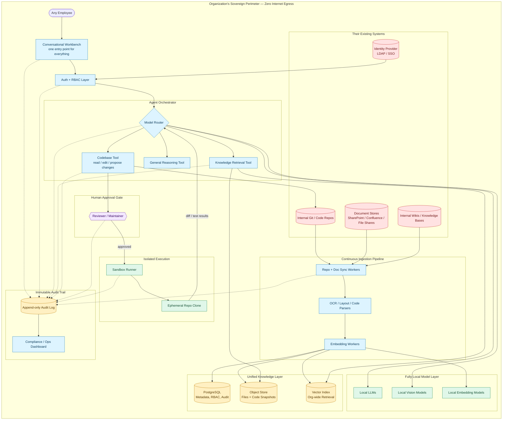

# Target State — Full Org Integration (Prod Vision)

Today the workbench is upload-and-process: a user hands it one file, it comes back with one result. The prod vision is different — the org's own codebase, docs, and systems live inside the sovereign perimeter permanently, kept in sync, and any employee just talks to the workbench like a colleague who already knows everything. Every single step, from a question typed in chat to a line of code changed in the repo, is logged.

### What's different from the current diagram

- **No more "upload a file, get a result."** The repo, the docs, the wikis are already inside the perimeter and stay in sync on their own — the user just asks.
- **One chat entry point** instead of separate upload/task flows — the workbench figures out whether it needs to search docs, read code, or both.
- **The codebase itself is a tool**, not a one-off attachment — the agent can read it, propose changes, and only a human reviewer decides if those changes actually touch the real repo.
- **Nothing leaves anything to chance** — every hop (chat → auth → router → tool → reviewer → sandbox) writes to the same append-only audit log, feeding a dashboard someone can actually check later.
- Still zero internet egress, still local models only — this scales up what's inside the wall, not what's allowed to leave it.
