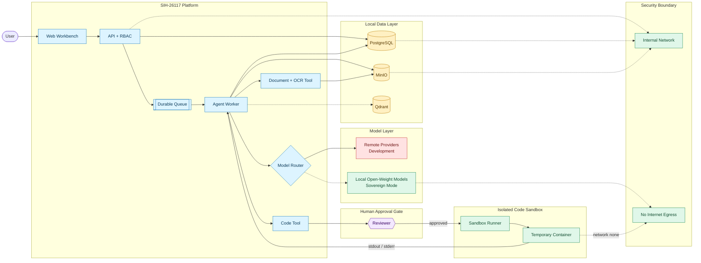

**SIH-26117 is an on-premise AI workbench: upload a document or submit code, it runs through a durable, auditable pipeline, and comes back as a real deliverable with citations and a reviewer approval gate on anything risky — with a clear path to zero internet egress.**

## Architecture diagram

### What to say about the diagram

- **Workbench** — uploads, tasks, generated artifacts, run trace.
- **Durable queue → agent worker** — the API doesn't execute anything itself. It writes the run to Postgres and hands it to the queue (RabbitMQ); a separate worker picks it up and executes it phase by phase, recording every tool call, evidence item, and audit event as it goes. That's why a run survives a restart mid-flight instead of vanishing.
- **PostgreSQL** — identity, RBAC, workspaces, runs, tool traces, evidence, audit. **MinIO** — the files, plus extracted text and citation metadata.
- **Document + OCR tool** — covers both plain text and OCR/layout extraction for PDFs, images, and Office files, so scanned documents aren't a dead end.
- **Human approval gate** — code doesn't run automatically. The code tool stops here and waits for a reviewer to approve the exact code before it ever reaches the sandbox.
- Untrusted code never runs inside the API — approved code goes to a separate **sandbox runner**: disposable, network-free container, output only.
- "Remote providers" is dev-only, and even in dev mode it only ever sees data explicitly marked public or synthetic. The sovereign deployment removes it entirely and routes the same interface to an internal model endpoint with no path out.

## Timing (15 min, two speakers)

Presenter 1 does problem/solution/demo. Shaun closes with architecture/security/roadmap.

| Elapsed | Who | What |
|---|---|---|
| 1:30 | P1 | Problem |
| 3:00 | P1 | Solution |
| 4:15 | P1 | What it delivers |
| 9:30 | P1 | Live demo |
| 10:00 | P1 | Handover |
| 12:15 | Shaun | Architecture |
| 13:30 | Shaun | Sovereignty / sandbox |
| 14:30 | Shaun | Status + roadmap |
| 15:00 | Shaun | Close |

## Presenter 1

**Problem (1:30)**

Refineries, PSUs, defence manufacturing, and government offices generate a huge amount of sensitive routine work — approval notes, inspection reports, engineering drawings, internal code, correspondence. None of that can go anywhere near a public AI tool, because the data itself is confidential. So today, teams either do all of it by hand, which is slow, or people quietly paste it into ChatGPT or Claude anyway, which is a real and growing risk nobody wants to admit out loud. At the same time, open-weight models have gotten good enough in the last year that you can actually build a useful assistant without sending anything to the cloud. That gap — useful AI tooling that never leaves the building — is what we're solving.

**Solution (3:00)**

SIH-26117 is that workbench, and it runs entirely on infrastructure the organization controls. You upload a document or hand it a coding task, it figures out which model is right for that job, does the work, and hands back something real — a DOCX approval note, a PPTX deck, an XLSX workbook, working code — not just a paragraph of chat text. But the actual point of this project isn't the model or the chat interface, because frankly any team can wire up a chatbot to an open-weight model in an afternoon. What's hard, and what we spent our time on, is everything around it: execution that survives a crash and picks back up where it left off, a human reviewer who has to approve anything risky like running code before it actually runs, and an audit trail that can answer exactly what happened, when, and why, for every single task.

**What it delivers (4:15)**

From the user's side, this feels simple. You open a workspace, upload a report, ask for an approval note, and download the result a minute later. But behind that one interaction, every run carries a full record — who asked for it, which model got picked and why, exactly which tools ran, what evidence those tools pulled up, and what came out the other end. In an industrial setting that matters as much as the answer itself, because if someone questions a generated approval note six months from now, you need to be able to show exactly what it was based on.

**Demo (9:30)**

1. Sign in, create a workspace.
2. Upload a prepared inspection-report file.
3. Type: "Read this inspection report and draft an approval note with the key findings."
4. Run it, and walk through what shows up — the task type it was routed as, the model that was picked, the run status, the evidence it cited, and the DOCX download once it finishes.
5. If there's time, submit a small coding task too, and show the run pause in "waiting on approval" until a reviewer signs off before the code actually executes.

While it's running, this is worth saying out loud: "This isn't a single request-response call. The file you just uploaded is a stored, versioned artifact, this task is now a durable job sitting in a queue, and every tool call it makes along the way is written down as a permanent record — none of that disappears even if the run fails halfway through."

If the model key isn't configured for the live demo, don't dance around it — just say: "This is failing closed with a clear configuration error, on purpose, instead of silently falling back to somewhere unexpected. In the actual sovereign deployment, this exact same code path points at an internal model instead."

**Handover (10:00)**

Hand off with something like: "That's the experience from the user's side. Now Shaun is going to walk through how this is actually built — why it's secure, why it's auditable, and how it adapts to running fully offline."

## Shaun's part

**Architecture (12:15)**

Here's the diagram. The most important decision baked into this is that the API never does the actual work itself — it writes the run to Postgres and hands it off to a queue, and a separate worker picks it up and executes it. That one decision is what makes a run resumable and cancellable instead of just being a long HTTP request that dies the moment the connection drops. The browser only ever talks to the API, and the API checks the JWT, the user's role, and their workspace membership before anything is allowed to run. Documents go through OCR and layout extraction before any analysis happens, so both a clean digital PDF and a scanned, messy inspection report both end up as structured, page-cited text instead of a wall of undifferentiated text with no way to trace a claim back to its source. Postgres holds all the structured state — users, roles, workspaces, runs, evidence, the audit trail. MinIO holds the actual files and extracted text. Qdrant holds the retrieval index, but we deliberately treat it as a rebuildable cache rather than a source of truth, so if it's ever wiped or corrupted, it can be regenerated from Postgres rather than losing anything real. And model routing is entirely a config file, not application code — each capability, document, vision, code, general, embedding, gets its own priority-ordered list of models, so swapping a remote model for an internal one for production is a config change, not a rewrite. That's what "no vendor lock-in" actually means here.

**Sovereignty / sandbox (13:30)**

We're careful about these two words specifically. Sovereign means the organization controls the data, the storage, the model endpoint, the access rules, and the logs. Air-gapped is a stronger claim — there is no route to the outside internet at all, full stop, and that has to be a property of the network, not something the model was merely instructed to respect. Concretely, remote inference here has to clear four separate checks at once — it has to be explicitly enabled, the provider has to be marked remote, there has to be a valid key, and the data itself has to be classified public or synthetic. If any single one of those isn't true, nothing gets sent, and critically, anything classified internal or confidential can never reach a remote provider even if every other flag happens to be on. In the sovereign Compose profile, that whole remote path is removed at the network level — there's no egress interface for the backend to even try to use. And code execution never happens inside the API process. It goes to a separate sandbox runner, and only after a human reviewer has approved the exact code that's about to run — a disposable container, no network access, a read-only filesystem, hard resource limits. The API only ever gets back stdout, stderr, and an exit code. One honest caveat: for a real production deployment, that no-egress guarantee still has to be enforced at the actual firewall. Compose removes our own path out, but it isn't a substitute for the organization's own network policy.

**Status + roadmap (14:30)**

What's actually built today: role-based access with reviewer approvals, durable queue-backed runs that survive a restart, OCR and layout extraction for documents, vision analysis on scanned pages, Qdrant-backed retrieval with access filtering, DOCX, PPTX, and XLSX generation, approval-gated sandboxed code execution, and a versioned, audited API. What's next: a fully local embedding model so retrieval doesn't need to make a single external call, optional reranking for better retrieval quality, and a richer live trace view so a reviewer can watch a run's tool activity as it happens instead of only seeing the final result.

**Close (15:00)**

The short version: this turns confidential document and code work into something a team can actually hand to an AI assistant, with a human still in the loop on anything that matters, and without any of it ever leaving the building. Thank you.

## Demo prep checklist

- Start early: `docker compose up -d --build`; verify `http://localhost:3000` and `http://localhost:4000/health`.
- Use a small, non-sensitive sample report tagged public/synthetic — that's what actually gates whether it's allowed to reach a dev-mode remote model.
- Rehearse the approval step if demoing a coding task — someone needs to be logged in with reviewer/admin access to approve it live.
- Only set the remote model API key if you're actually demoing live dev-mode inference.
- Don't expose dev secrets in the browser or slides.
- Have a generated DOCX ready in advance as a fallback — call it out as a previous run if you use it.
- Screenshot the Mermaid diagram for slides; not every presentation tool renders Mermaid.

## Likely questions

Q&A is its own 15 minutes, so plan for more than the handful of deep-technical ones — most of the room will ask about how it works day to day, not gotcha questions.

### What people will actually ask

| Question | Answer |
|---|---|
| What file types does it actually handle? | PDF, images, DOCX, PPTX, XLSX, CSV, Markdown, and plain text — both scanned and born-digital. Scanned/image material goes through OCR automatically; you don't pick a mode. |
| What if the model gets something wrong in the note it drafts? | Every claim is either backed by an extracted source passage or flagged as model output — those are kept separate, not blended. A reviewer sees the note and its citations before it's treated as final. |
| What hardware do you actually need to run this? | One machine with a mid-range GPU is enough for the small local models in the demo config; the model list is a config file, so you can size up or down without touching code. |
| Can more than one person use it at the same time? | Yes — runs are queued per workspace and per user with configurable concurrency limits, so it doesn't fall over with a second person hitting it. |
| Who's this actually for, day to day? | Engineers and officers who currently draft approval notes, review inspection reports, or write small internal tools by hand — the target is replacing that manual grind, not adding a chatbot on top of it. |
| Is it really usable with zero internet, or is that just a mode you flipped on for the demo? | Sovereign mode removes the network path entirely at the Compose level, not just a setting the app checks — there's no egress interface attached for it to use even if something tried. |
| What's built vs what's still on the roadmap? | RBAC, durable runs, OCR extraction, retrieval, DOCX/PPTX/XLSX generation, and approval-gated code execution are working today. Fully offline embeddings, reranking, and a richer live-trace UI are next. |
| How is this different from just pointing a local LLM at a chat UI? | The model is the easy part — anyone can self-host one. The actual work here is everything around it: durable runs that survive a crash, evidence you can trace back to a source, and a human approval gate before anything consequential happens. |
| What happens with a huge file, like a 200-page report? | Extraction and chunking are bounded, and there are upload/size limits — it's built to fail closed on something oversized rather than hang or silently truncate without telling you. |
| Does it remember past conversations or documents per user? | Retrieval is scoped to a workspace, either private to that workspace or shared org-wide — it's not a single global memory blob everyone shares. |

### Deeper technical follow-ups

| Question | Answer |
|---|---|
| Is it actually air-gapped today? | Not in dev mode — that can use a remote model, though only on data explicitly marked public/synthetic. The sovereign profile removes remote inference and egress entirely; a real air-gap also needs firewall-level enforcement on top of that. |
| Why not one big model for everything? | Different tasks need different things, and it's a config file, not code — each capability gets its own priority-ordered model list, so a model can be swapped or added without touching the backend. |
| How do you stop data leakage? | Classification is checked independently of the sovereign/dev toggle — internal or confidential data can't reach a remote provider even if remote inference is otherwise enabled. In sovereign mode there's no remote path at all. |
| Is the generated output trustworthy? | Not treated as proof on its own. Evidence is tagged as either sourced from a document or model-generated, kept separate, and reviewer approval is required before anything with real-world effect — like running code — actually executes. |
| Why a separate sandbox runner, and why does it wait for approval? | So untrusted code never runs inside the API process, and so a human sees the exact code before it runs, not after. |
| What's Qdrant actually doing? | It's the retrieval index for ingested knowledge — chunked, embedded, access-filtered per workspace. It's treated as rebuildable from Postgres, not as its own source of truth. |
| What happens if the worker crashes mid-run? | The run's state is in Postgres and the job is durably queued, so a restart doesn't lose it — an expired claim gets recovered and re-attempted rather than silently dropped. |
